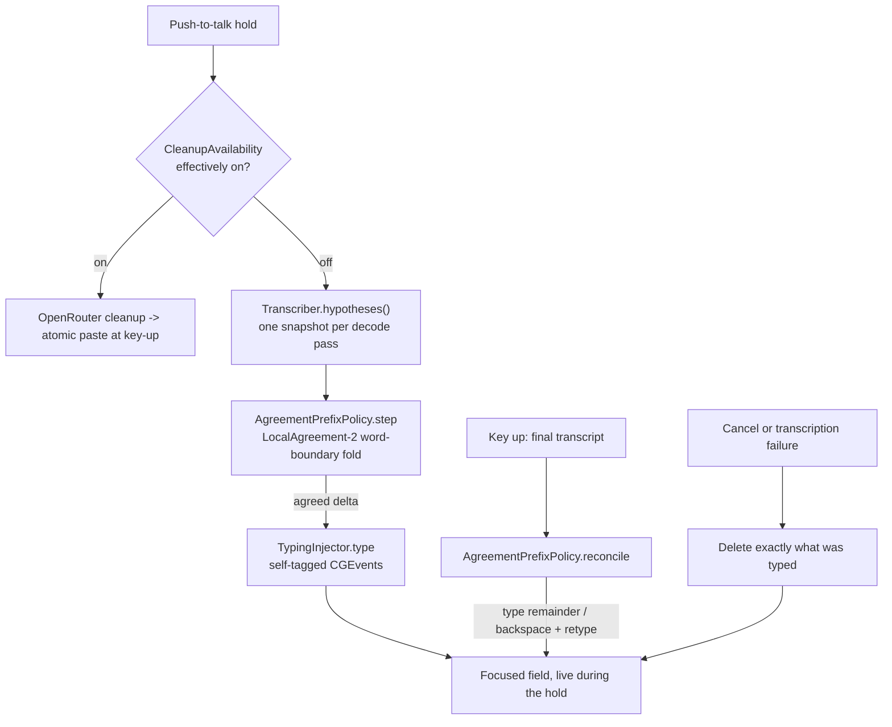

# Architecture

Slovo is a native Swift menu-bar app with a small composition root and testable
core seams.

## Pipeline

The dictation flow is:

```text
key down -> mute output (when enabled) -> start microphone + live recognition
key held -> convert each audio chunk -> update live recognition
key up   -> stop capture -> finalize unfinished tail -> clean -> inject
```

Raw audio stays on the Mac and is transcribed on-device through WhisperKit
(Whisper large-v3 turbo). Cleanup is always attempted through OpenRouter and
sends only transcript text for the selected routed model id.

## Core Components

- `HotkeyMonitor` observes the configured push-to-talk key (`fn` / Globe by
  default, or a right-hand modifier); `HotkeyDecisionCore` is the pure,
  unit-tested policy that turns key events into start / stop (plain or
  translate) / silent-cancel decisions.
- `SystemAudioController` mutes and restores system output during recording, when
  the "Mute Audio While Dictating" menu setting is on (the default); with it off,
  Slovo neither mutes nor restores.
- `AudioRecorder` captures microphone audio and converts it to 16 kHz mono float
  samples.
- `WhisperKitTranscriber` feeds audio into WhisperKit's live transcriber and
  finalizes only its unfinished tail at key-up. On a short final pass with a
  non-empty live result and no confirmed prefix, Slovo rejects a terminal
  addition only when the final decode is the exact normalized live result plus
  an anomalous suffix timestamped strictly beyond the recorded audio. The model
  remains resident between dictations.
- `Cleaner` rewrites the transcript into final prose when OpenRouter cleanup
  succeeds.
- `Injector` inserts the final text into the focused field with an atomic paste.
- `CleanupAvailability` is the app layer's single source of truth for whether
  cleanup is effectively on and, when off, why (toggled off vs. no OpenRouter
  key). The menu, Settings, the recording glyph, and the orchestrator push all
  read this one derivation (`preference && keyPresent`), so the state is never
  re-derived divergently.
- `AgreementPrefixPolicy` is the pure live-typing text policy used when cleanup
  is off: a LocalAgreement-2 word-boundary fold over the hypothesis stream that
  emits only agreed word prefixes during the hold, plus the key-up reconciliation
  math (already-exact / type-remainder / backspace-and-retype) bounded by what
  was actually typed.
- `TypingInjector` types the agreed deltas into the focused field via synthesized
  keystrokes and never touches the pasteboard. Its CGEvents carry a self-tag so
  the hotkey tap tells Slovo's own keystrokes from the user's and never treats
  live typing as an interrupt-cancel.
- `PersonalizationSource` supplies local vocabulary hints.
- `InputSourceLanguageReading` and `SpellCheckHintProviding` supply on-device
  cleanup hints — the active keyboard language and system spell-check
  suggestions — as advisory context for the cleanup prompt.
- `Orchestrator` serializes the pipeline and owns the runtime state transitions.

The app target owns OS-specific adapters and production composition. `SlovoCore`
owns the seams, value types, state machine, storage, cleanup, transcription, and
injection behavior.

## Cleanup

Cleanup has one runtime provider:

- OpenRouter Chat Completions API.

The app stores one OpenRouter key in Keychain and exposes model selection as
curated OpenRouter model ids and a custom id entry. Selecting a model changes
only the model id. The key is read lazily when cleanup runs. Before each
cleanup, Slovo adds advisory on-device hints to the prompt — the active keyboard
language and, when enabled, system spell-check suggestions — which the model may
use but never must; these hints travel to OpenRouter in the prompt alongside the
transcript, and only the raw audio never leaves the Mac.

Holding Control together with the push-to-talk key at any moment during the hold
marks that dictation for translation: the same single cleanup request also
translates the result into the configured target language, instead of running a
second pass. A plain hold stays untranslated. The target defaults to English and
is chosen in the menu bar (**Translate to: …**) or Settings; the offered
languages are the recognition-language list without **Auto**, since a translate
target must be concrete.

Cleanup is sad-to-fail. If OpenRouter is missing, unavailable, misconfigured,
refuses the request, rate-limits, or returns an unusable response, Slovo inserts
the direct transcript — untranslated on a translate hold — and briefly shows the
`Ⱁ` error glyph instead of cancelling the dictation.

## Live Typing (cleanup off)

When cleanup is effectively off — the user turned **Clean Up Dictation** off, or
no OpenRouter key is configured — the dictation stays entirely on-device and the
orchestrator types stabilized words into the focused field during the hold
instead of pasting once at key-up. Nothing but synthesized keystrokes reaches the
field, and the text never transits the clipboard. A single reconciliation pass at
key-up makes the field match the final transcript; a cancel or a failed
transcription deletes exactly what was typed (nothing is left inserted).



## Storage

Slovo uses SQLite through GRDB for local personalization data:

- `vocabulary` stores spelling anchors and term weights.
- `corrections` is reserved for future correction memory.
- `profile` stores small local context facts.

The repository tracks only schema and migrations. Local databases and seed files
are never committed.

## Menu-Bar App

The app is packaged as an `LSUIElement` menu-bar app. It has no Dock icon and uses
an `NSStatusItem` for status, cleanup model selection, the translate-to target
language, the mute-while-dictating switch, vocabulary quick-add, first-run setup
actions, a **Settings…** window (push-to-talk key, recognition language, launch at
login, cleanup model and style, translation target, OpenRouter key, and
vocabulary), quit, and an **About** window with a quick guide and the running
version. All configuration is native windows — there are no modal alerts.

## Build Boundaries

SwiftPM is the source of truth. All Swift targets build with warnings as errors,
strict concurrency checking, and actor data-race checks; the one Objective-C
target (`SlovoObjC`, an exception-catcher shim Swift cannot express) is exempt,
since those settings do not apply to `.m` sources. SwiftLint is pinned through a
SwiftPM plugin and is part of the release gate.
