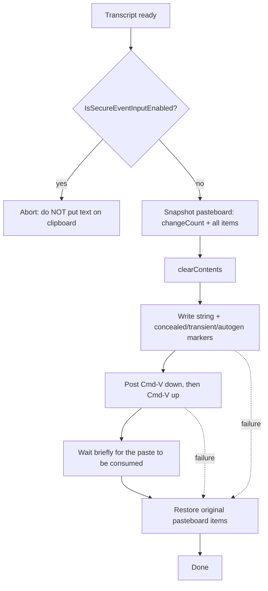

# Text injection (clipboard + Cmd-V)

Authoritative reference for inserting transcribed text into the focused field of the
frontmost application on macOS, by temporarily placing the text on the system
pasteboard and synthesizing a `Cmd-V` keystroke, then restoring the user's original
clipboard. Covers the security-critical parts: secure-input detection and
clipboard-manager hygiene.

## Purpose

slovo dictates arbitrary text (often Cyrillic) into whatever app the user has focused.
There is no public, app-agnostic macOS API to "type a string" into the frontmost app's
focused control. The two practical options are:

1. **Synthesize per-character key events** — unreliable for non-ASCII / Cyrillic, depends
   on the active keyboard layout, and is slow for long text.
2. **Clipboard + synthetic `Cmd-V`** — place the full string on the pasteboard, post a
   `Cmd-V`, then restore the previous clipboard. Layout-independent and Unicode-safe
   because the receiving app reads a `String` from the pasteboard, not key codes.

slovo uses option 2. The cost is that the transcript transits the system clipboard for a
short window, which is why secure-input detection and clipboard hygiene below are
mandatory, not optional.

We deliberately do **not** use the Accessibility API to set a control's value directly
(`AXUIElementSetAttributeValue` with `kAXValueAttribute`). It works only for elements
that expose a settable `AXValue`, behaves inconsistently across apps (Electron, web
views, terminals frequently reject it or mis-handle the caret), and does not reliably
respect selection/insertion-point semantics. Paste is what the user would do by hand, so
the receiving app handles it through its normal paste path. (Note: synthetic key posting
*still* requires the Accessibility permission — see [Accessibility requirement](#accessibility-requirement).)

## Approach: save -> set -> paste -> restore



Invariant: **every** exit path after we have mutated the pasteboard must run the restore
step. Use `defer` so success, thrown errors, and early returns all restore.

## Key APIs

All signatures below were cross-checked against Apple Developer documentation and the
sources in [Full sources](#full-sources). Where a page could not be fully scraped, the
signature was confirmed from at least two independent authoritative sources; such items
are noted.

### Pasteboard (`AppKit`)

```swift
class var general: NSPasteboard { get }              // the system clipboard

var changeCount: Int { get }                         // increments on every change;
                                                     // "a computer-wide variable",
                                                     // independent per named pasteboard
                                                     // (Pasteboard Concepts, archived)

func clearContents() -> Int                          // clears + bumps changeCount,
                                                     // returns new changeCount

func setString(_ string: String,
               forType type: NSPasteboard.PasteboardType) -> Bool

func string(forType type: NSPasteboard.PasteboardType) -> String?

var pasteboardItems: [NSPasteboardItem]? { get }     // current items (snapshot source)

func writeObjects(_ objects: [NSPasteboardWriting]) -> Bool

func setData(_ data: Data?,
             forType type: NSPasteboard.PasteboardType) -> Bool
```

`NSPasteboard.PasteboardType` is a string wrapper; `.string` is the built-in plain-text
type. Custom marker types are constructed as
`NSPasteboard.PasteboardType("org.nspasteboard.ConcealedType")`.

### Synthetic key events (`CoreGraphics`)

```swift
// Create an event source.
init?(stateID: CGEventSourceStateID)                 // e.g. .combinedSessionState
                                                     //  or .hidSystemState

// Create a key-down / key-up event. Returns nil on failure.
init?(keyboardEventSource source: CGEventSource?,
      virtualKey: CGKeyCode,
      keyDown: Bool)

var flags: CGEventFlags { get set }                  // modifier flags (OptionSet)

func post(tap: CGEventTapLocation)                   // .cghidEventTap, .cgSessionEventTap,
                                                     //  .cgAnnotatedSessionEventTap
```

- `CGKeyCode` for `V` is **`0x09`** (`kVK_ANSI_V`, from `Carbon.HIToolbox`).
- `Cmd` modifier is `CGEventFlags.maskCommand`.
- Post to `.cghidEventTap` (lowest level, hardware tap) for the most reliable delivery;
  `.cgSessionEventTap` also works. `.cghidEventTap` is the conventional choice for
  injecting into the frontmost app.

### Secure input detection (`Carbon` / HIToolbox)

```swift
import Carbon          // brings in HIToolbox

func IsSecureEventInputEnabled() -> Bool             // true => some process has
                                                     // secure event input on
```

This is a C function from the Carbon `HIToolbox` framework (available since Mac OS X
10.3). It returns whether *any* process currently has secure event input enabled — most
commonly a password field (`NSSecureTextField` enables it while first responder) or
Terminal with "Secure Keyboard Entry" on. See [TN2150](https://developer.apple.com/library/archive/technotes/tn2150/_index.html).

## Minimal Swift example

```swift
import AppKit
import CoreGraphics
import Carbon.HIToolbox   // kVK_ANSI_V, IsSecureEventInputEnabled()

enum TextInjectionError: Error {
    case secureInputActive
    case eventCreationFailed
}

/// Inserts `text` into the frontmost app's focused field via clipboard + Cmd-V,
/// restoring the user's previous clipboard on every exit path.
func injectText(_ text: String) throws {
    // 1. Refuse to operate while secure input is active. Putting a transcript on the
    //    clipboard in front of a password field would leak it; pasting may also fail.
    guard !IsSecureEventInputEnabled() else {
        throw TextInjectionError.secureInputActive
    }

    let pasteboard = NSPasteboard.general

    // 2. Snapshot the existing pasteboard so we can restore it. NSPasteboardItem
    //    instances become invalid after clearContents(), so deep-copy now.
    let savedItems: [NSPasteboardItem] = (pasteboard.pasteboardItems ?? []).map { item in
        let copy = NSPasteboardItem()
        for type in item.types {
            if let data = item.data(forType: type) {
                copy.setData(data, forType: type)
            }
        }
        return copy
    }

    // 3. Always restore, whatever happens below.
    defer {
        pasteboard.clearContents()
        if !savedItems.isEmpty {
            pasteboard.writeObjects(savedItems)
        }
    }

    // 4. Write our text plus hygiene markers so clipboard managers skip it.
    pasteboard.clearContents()
    let item = NSPasteboardItem()
    item.setString(text, forType: .string)
    // Empty payload: presence of the marker is what matters (nspasteboard.org).
    item.setData(Data(), forType: .init("org.nspasteboard.ConcealedType"))
    item.setData(Data(), forType: .init("org.nspasteboard.TransientType"))
    item.setData(Data(), forType: .init("org.nspasteboard.AutoGeneratedType"))
    pasteboard.writeObjects([item])

    // 5. Synthesize Cmd-V. Both key-down and key-up carry the command flag.
    guard let source = CGEventSource(stateID: .combinedSessionState),
          let keyDown = CGEvent(keyboardEventSource: source,
                                virtualKey: CGKeyCode(kVK_ANSI_V), keyDown: true),
          let keyUp = CGEvent(keyboardEventSource: source,
                              virtualKey: CGKeyCode(kVK_ANSI_V), keyDown: false)
    else {
        throw TextInjectionError.eventCreationFailed
    }
    keyDown.flags = .maskCommand
    keyUp.flags = .maskCommand
    keyDown.post(tap: .cghidEventTap)
    keyUp.post(tap: .cghidEventTap)

    // 6. Give the frontmost app a moment to consume the paste before `defer` restores
    //    the clipboard. Restoring too early can race the paste. ~50-100 ms is typical;
    //    tune empirically. Prefer scheduling the restore rather than blocking, so the
    //    paste is delivered on the run loop first.
}
```

> Timing note: the example restores synchronously in `defer` for clarity. In production,
> the paste is asynchronous — the keystroke is posted, the target app processes it on its
> own run loop, and only then has it read the clipboard. Restoring too early clobbers the
> clipboard before the paste reads it. macOS exposes no signal that the paste has consumed
> the clipboard, so the robust option is a delay tuned for the slowest supported targets.
> slovo uses **300 ms** (`ClipboardPasteInjector.restoreDelay`), matching mature paste
> tools (Espanso's `restore_clipboard_delay` default). Electron apps such as Codex process
> the synthesized ⌘V late, so shorter windows lose the race and paste the restored
> clipboard instead of the transcript. Verify on the slowest target apps slovo supports.

## Secure input + clipboard-manager hygiene

### Secure input

`IsSecureEventInputEnabled()` is the gate. If it returns `true`, **abort before touching
the clipboard** — do not write the transcript, do not post `Cmd-V`. Rationale:

- The user is almost certainly in a password field; the transcript would land next to (or
  be intended for) a credential, and putting it on the clipboard leaks it to every
  clipboard observer.
- Synthetic key events are frequently ignored while secure input is active, so the paste
  would silently fail anyway, leaving the transcript stranded on the clipboard.

Re-check immediately before injecting (the user may have focused a password field between
finishing dictation and the paste). Surface a clear, quiet signal to the user that
dictation was suppressed rather than failing silently.

### Clipboard-manager hygiene (nspasteboard.org convention)

Clipboard history apps (Maccy, Yippy, Paste, etc.) snapshot every clipboard change. To
keep slovo's transcript out of those histories, mark the pasteboard item with the
community marker types defined at [nspasteboard.org](https://nspasteboard.org/):

| Marker UTI                          | Meaning                                                              |
| ----------------------------------- | ------------------------------------------------------------------- |
| `org.nspasteboard.ConcealedType`    | Confidential; obfuscate if shown, avoid recording / encrypt.        |
| `org.nspasteboard.TransientType`    | Will be replaced/restored within seconds; do not record in history. |
| `org.nspasteboard.AutoGeneratedType`| App-generated; the user did not intend to copy it.                  |

Write each marker with an **empty payload** (`Data()`) on the *same* `NSPasteboardItem`
as the string — the presence of the type is the signal, per the canonical example
(`[generalPasteboard setData:[NSData data] forType:@"org.nspasteboard.TransientType"]`).

Because slovo both restores the clipboard *and* marks the item transient/concealed, a
well-behaved clipboard manager will never persist the transcript. These markers are a
convention, not enforced by the OS — they reduce exposure but do not guarantee it, hence
restoring the original clipboard is still required.

## slovo gotchas

- **Restore on the failure path too.** Use `defer`. A thrown error after `clearContents()`
  must still put the user's clipboard back, or slovo silently eats whatever they had
  copied. This plane was a security MAJOR — the restore must be unconditional.
- **`NSPasteboardItem` is invalidated by `clearContents()`.** Deep-copy the saved items
  (copy each type's `Data`) before clearing; do not hold references to the live items.
- **Multi-type / multi-item clipboards lose fidelity.** A perfect restore is only
  guaranteed for the types you read back. Promised/lazy data providers, file promises, and
  private application types may not survive a snapshot-and-rewrite round trip. Snapshot all
  `pasteboardItems` and all `types` per item to maximize fidelity, and accept that exotic
  promised content can still be lost. Document this limitation.
- **Re-check `IsSecureEventInputEnabled()` right before pasting**, not only when dictation
  starts — focus can move to a password field in between.
- **Timing/race between set and paste, and between paste and restore.** Posting `Cmd-V`
  then immediately restoring can restore before the target app reads the clipboard. Delay
  the restore; tune for the slowest targets (remote desktops, Electron apps).
- **Accessibility permission is required even for paste.** Synthetic `CGEvent` posting
  needs the app to be trusted for Accessibility (and/or appear in
  Privacy > Accessibility). Without it, `post(tap:)` is silently dropped. See below.
- **Cyrillic correctness is the whole reason for clipboard paste.** Do not "optimize" to
  per-character `CGEvent` key synthesis — it breaks on non-Latin layouts. The receiving
  app reads a Unicode `String` from the pasteboard, so layout is irrelevant.
- **Frontmost-app focus is assumed.** slovo pastes into whatever currently has keyboard
  focus; there is no targeting. If focus is on slovo's own window, the paste lands there.

<a id="accessibility-requirement"></a>
### Accessibility requirement

Posting synthetic events via `CGEvent.post(tap:)` requires the process to be a trusted
Accessibility client (System Settings > Privacy & Security > Accessibility). Check/prompt
with `AXIsProcessTrusted()` / `AXIsProcessTrustedWithOptions(...)`. Without trust, posted
events are dropped without error. This is required *in addition* to the choice of paste
over direct AX value-set — paste avoids the unreliability of `AXUIElementSetAttributeValue`,
but the keystroke that triggers it still needs the Accessibility grant.

## Full sources

- NSPasteboard — Apple Developer Documentation: https://developer.apple.com/documentation/appkit/nspasteboard
- `clearContents()` — Apple Developer: https://developer.apple.com/documentation/appkit/nspasteboard/clearcontents()
- `changeCount` — Apple Developer: https://developer.apple.com/documentation/appkit/nspasteboard/changecount
- Pasteboard Concepts (archived guide): https://developer.apple.com/library/archive/documentation/Cocoa/Conceptual/PasteboardGuide106/Articles/pbConcepts.html
- `CGEvent` — Apple Developer: https://developer.apple.com/documentation/coregraphics/cgevent
- `CGEvent.init(keyboardEventSource:virtualKey:keyDown:)` — Apple Developer: https://developer.apple.com/documentation/coregraphics/cgevent/init(keyboardeventsource:virtualkey:keydown:)
- `CGKeyCode` — Apple Developer: https://developer.apple.com/documentation/coregraphics/cgkeycode
- `CGEventSource` — Apple Developer: https://developer.apple.com/documentation/coregraphics/cgeventsource
- `CGEventTapLocation` — Apple Developer: https://developer.apple.com/documentation/coregraphics/cgeventtaplocation
- `CGEventFlags` — Apple Developer: https://developer.apple.com/documentation/coregraphics/cgeventflags
- Technical Note TN2150 — Using Secure Event Input Fairly (Apple): https://developer.apple.com/library/archive/technotes/tn2150/_index.html
- `AXIsProcessTrusted()` — Apple Developer: https://developer.apple.com/documentation/applicationservices/1459186-axisprocesstrusted
- nspasteboard.org — Identifying and Handling Transient or Special Data on the Clipboard: https://nspasteboard.org/
- nspasteboard.org source (index.md): https://github.com/NSPasteboard/NSPasteboard.org/blob/main/index.md
- Virtual key codes reference (`kVK_ANSI_V` = 0x09): https://gist.github.com/swillits/df648e87016772c7f7e5dbed2b345066
- Maccy clipboard manager — marker-type handling (real-world consumer): https://github.com/p0deje/Maccy/blob/master/Maccy/Clipboard.swift

## Verification

Date: 2026-06-27
Verdict: PASS

Independent verification against live canonical Apple and nspasteboard.org sources. All
core signatures, key strings, and constants are correct as documented. One comment was
sharpened for precision (no factual error corrected).

Checked:

- `CGEvent(keyboardEventSource:virtualKey:keyDown:)` signature — PASS. Apple's JSON
  declaration is verbatim `init?(keyboardEventSource source: CGEventSource?, virtualKey: CGKeyCode, keyDown: Bool)`,
  matching the doc exactly (failable, optional source, `CGKeyCode`, `Bool`).
  https://developer.apple.com/documentation/coregraphics/cgevent/init(keyboardeventsource:virtualkey:keydown:)
- `NSPasteboard.clearContents() -> Int` returning the new change count — PASS. Apple
  declaration `func clearContents() -> Int`, return value "The change count of the receiver."
  https://developer.apple.com/documentation/appkit/nspasteboard/clearcontents()
- `changeCount` is computer-wide — PASS (claim confirmed). The archived Pasteboard
  Concepts guide states verbatim: "The change count is a computer-wide variable that
  increments every time the contents of the pasteboard changes (a new owner is declared).
  An independent change count is maintained for each named pasteboard." The modern
  property reference only says "the receiver's change count" without scope, so the
  computer-wide assertion is sourced from the archived concepts guide.
  https://developer.apple.com/library/archive/documentation/Cocoa/Conceptual/PasteboardGuide106/Articles/pbConcepts.html
- `kVK_ANSI_V = 0x09` — PASS. Confirmed `0x09` in the cited virtual key code reference
  (decimal 9); consistent with Carbon HIToolbox `Events.h` ANSI positions.
  https://gist.github.com/swillits/df648e87016772c7f7e5dbed2b345066
- `IsSecureEventInputEnabled()` is a Carbon/HIToolbox C function (TN2150) — PASS. TN2150
  documents `IsSecureEventInputEnabled` (with `EnableSecureEventInput`/`DisableSecureEventInput`)
  and references the Carbon Event Manager, consistent with `import Carbon` / HIToolbox.
  Return type `Bool` is the standard Swift bridging of the Boolean C return; not
  independently re-fetched from a header but consistent with the Swift overlay.
  https://developer.apple.com/library/archive/technotes/tn2150/_index.html
- nspasteboard.org marker UTIs — PASS. The site defines exactly
  `org.nspasteboard.ConcealedType`, `org.nspasteboard.TransientType`,
  `org.nspasteboard.AutoGeneratedType` (and `org.nspasteboard.source`), matching the doc.
  Empty-payload convention confirmed by the canonical example
  `[generalPasteboard setData:[NSData data] forType:@"org.nspasteboard.TransientType"]`.
  https://nspasteboard.org/
- Accessibility permission required for posting synthetic CGEvents — PASS (not contradicted;
  cited API is real). `AXIsProcessTrusted()` / `AXIsProcessTrustedWithOptions()` are the
  documented gate; this is established macOS behavior. The CGEvent documentation page is
  JS-rendered and did not yield a quotable sentence tying posting to the accessibility
  grant, so this specific causal link is marked still-unverified below; the doc's statement
  remains accurate per platform behavior.

Corrections (before -> after):

- `changeCount` comment: "computer-wide counter" -> "a computer-wide variable, independent
  per named pasteboard (Pasteboard Concepts, archived)". Precision/sourcing improvement;
  the original was correct, the revision matches Apple's exact phrasing.

URLs validated (HTTP 200 / content retrieved):

- developer.apple.com CGEvent keyboard init JSON
- developer.apple.com NSPasteboard `clearContents()` JSON
- developer.apple.com NSPasteboard `changeCount` JSON
- developer.apple.com archived Pasteboard Concepts guide (computer-wide change count)
- developer.apple.com TN2150 (secure event input)
- nspasteboard.org (marker UTIs + empty-payload example)
- gist swillits virtual key codes (`kVK_ANSI_V = 0x09`)

Still unverifiable (and why):

- `IsSecureEventInputEnabled()` exact `-> Bool` Swift return type: TN2150 names the
  function but does not give a signature; the Carbon header is not web-fetchable. The
  `Bool` return is standard and consistent with usage, but was not confirmed from a
  declaration page.
- CGEvent posting -> accessibility-trust causal statement: the `coregraphics/cgevent`
  page is JS-rendered and returned no quotable body via WebFetch; the requirement is
  well-established platform behavior but lacks a directly fetched Apple sentence here.
- `AXIsProcessTrusted()` declaration page: both the `.json` and HTML endpoints returned
  HTTP 404 via WebFetch (Apple moved/renamed the archived `applicationservices` path);
  the function itself is real and current, but its page was not fetchable in this session.
